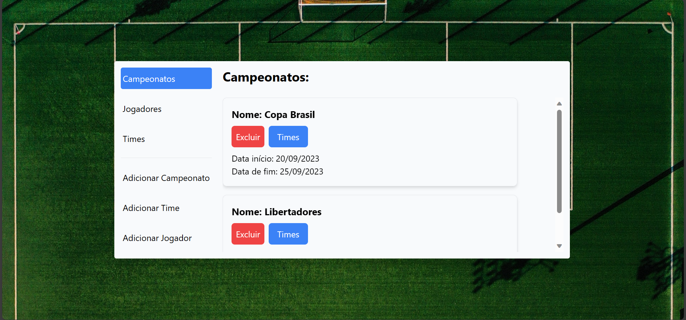
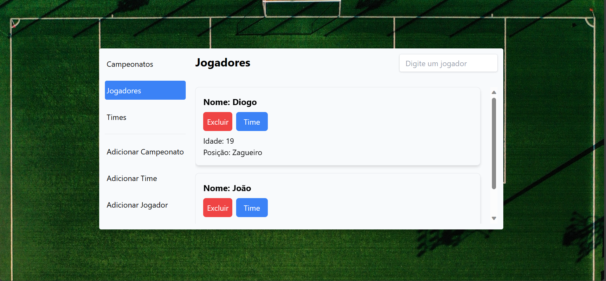
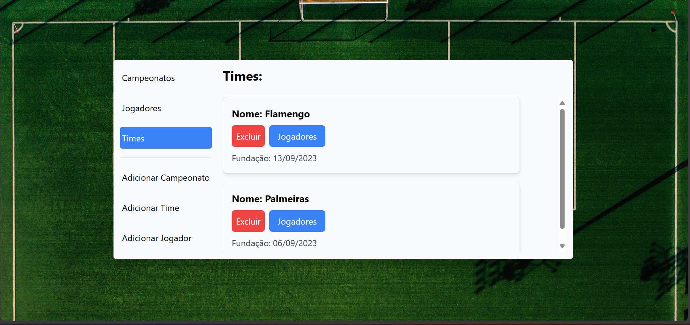
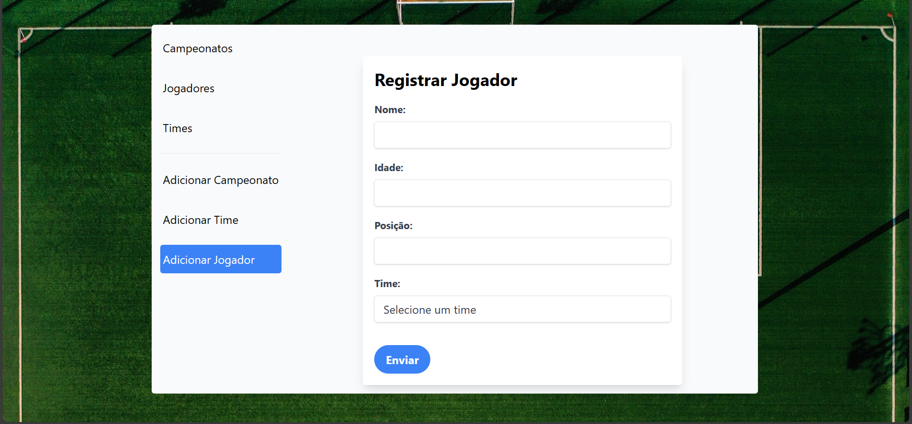
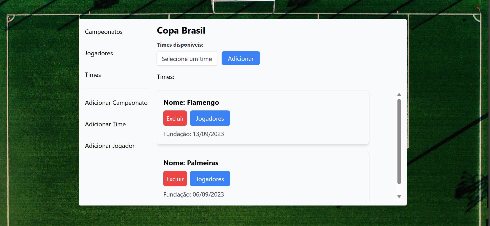
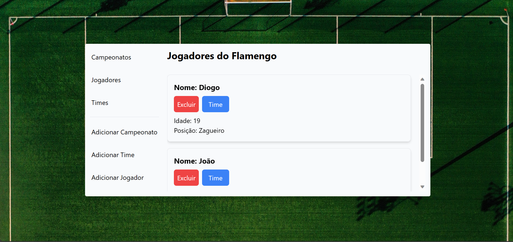

# Gerenciamento de Campeonatos, Times e Jogadores - Projeto React [](https://github.com/dxxiogo/desafio-3-bootcamp-avanti/blob/main/LICENSE)

## Descrição

Este projeto permite o gerenciamento de informações esportivas, permitindo a criação, visualização e gerenciamento de campeonatos, times e jogadores. Foi desenvolvido como projeto final do Curso de Desenvolvimento Full Stack [Atlântico Avanti](https://edu.atlanticoavanti.com.br/portal/home/ "Site do Atlântico Avanti") pela equipe "Iara Devs", composta por Diogo Santana Freitas e Pietra Almeida S. Costa.

## Consumo da API
Este projeto consome a API disponível em GitHub - Projeto Iara Devs. A API fornece os dados necessários para o gerenciamento de campeonatos, times e jogadores nesta aplicação React.

## Screenshots da Aplicação
Aqui estão algumas capturas de tela da aplicação para ajudá-lo a visualizar as diferentes páginas e funcionalidades:

### Página de Campeonatos


### Página de Jogadores



### Página de Times



### Página de Criação de Campeonatos


### Página de Criação de Jogadores



### Página de Times de um Campeonato Específico



### Página de Jogadores de um Time Específico




## Executando o Projeto Localmente

Para executar este projeto em seu ambiente de desenvolvimento, siga estas etapas:

### Pré-requisitos

- Certifique-se de ter o [Node.js](https://nodejs.org/) instalado em seu sistema.
- Você precisará de um editor de código, como o [Visual Studio Code](https://code.visualstudio.com/).

### Passos de Execução

1. Clone este repositório para o seu computador local usando o seguinte comando:

```bash
 #Clone o repositório:
  git clone https://github.com/dxxiogo/desafio-3-bootcamp-avanti/tree/main

 #Navegue até o diretório do projeto:
  cd seu-projeto

 #Instale as dependências:
 npm install

#Inicie a aplicação com o seguinte comando:
npm start

A aplicação estará disponível em http://localhost:3000.
```
# Gerenciamento de Campeonatos, Times e Jogadores - Projeto React

...

## Como Usar a Aplicação

Aqui estão as instruções básicas sobre como usar esta aplicação para gerenciar campeonatos, times e jogadores:

### 1. Início

Após seguir as etapas de configuração e execução mencionadas anteriormente, acesse a aplicação em seu navegador no endereço `http://localhost:3000`.

### Hooks React Utilizados
Este projeto utiliza Hooks React para gerenciamento de estados e efeitos. Aqui estão alguns dos principais hooks utilizados:

useState: Usado para gerenciar estados locais em componentes funcionais. Por exemplo, para armazenar o estado de um formulário de criação.

- useEffect: Utilizado para realizar efeitos colaterais, como buscar dados da API quando o componente é montado.

- useContext: Usado para acessar o contexto da aplicação e compartilhar estados entre componentes.

- useHistory (do React Router): Utilizado para navegar entre as páginas da aplicação.

- useParams (do React Router): Usado para acessar os parâmetros de rota nas páginas.

## Contribuição 
Para contribuir com este projeto, siga as etapas abaixo:

1. Crie um fork deste repositório.

2. Clone o fork para a sua máquina local.

3. Crie uma nova branch para sua contribuição:
```bash
  git checkout -b minha-contribuicao
```
4. Faça suas alterações e commit:
```bash
 git commit -m "Adiciona funcionalidade X"
```
5. Envie suas alterações para o GitHub:
```bash
 git push origin minha-contribuicao
```
6. Abra uma solicitação de pull descrevendo suas alterações.

### Agradecimentos
Agradecemos ao  [Atlântico Avanti](https://edu.atlanticoavanti.com.br/portal/home/ "Site do Atlântico Avanti"), pela oportunidade de participar do Bootcamp através de bolsa de estudos, pelo investimento em nosso crescimento profissional, ao professor [Germanno Teles] e à monitora [Jheyele Raquel] por todo conhecimento passado através de uma excelente didática e pela disposição em sempre ajudar, mesmo fora dos horários das aulas. Suas orientações, conhecimentos e apoio foram fundamentais para o sucesso deste projeto. 


# Equipe Iara Devs: 
Diogo Santana Freitas 
Pietra Almeida S. Costa

## contatos Diogo Santana Freitas :
<div> 
    <a href = "mailto:diogosantanafreitasuna@gmail.com"></a>
    <a href="https://br.linkedin.com/in/diogo-santana-freitas-78852321b" target="_blank"></a>   
</div>

## contatos Pietra Almeida :
<div> 
    <a href = "mailto:costapietra@gmail.com"></a>
    <a href="https://www.linkedin.com/in/almeidapietra" target="_blank"></a>   
</div>
